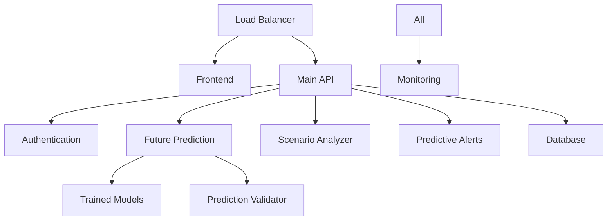

# Deployment Guide 🚀

## Overview

This guide covers the complete deployment process for the Froth Flotation Digital Twin system with future prediction capabilities. It includes automated deployment pipelines, version management, monitoring setup, and rollback procedures.

## 📋 Deployment Checklist

### Pre-Deployment
- [ ] **Code Review**: All changes reviewed and approved
- [ ] **Testing**: All tests passing (100% pass rate required)
- [ ] **Performance**: Benchmark tests meet requirements
- [ ] **Documentation**: Updated user guides and API docs
- [ ] **Models**: Trained models validated and ready
- [ ] **Environment**: Target environment prepared

### Deployment
- [ ] **Backup**: Current system backed up
- [ ] **Dependencies**: All dependencies installed/updated
- [ ] **Configuration**: Environment-specific configs applied
- [ ] **Models**: New models deployed and validated
- [ ] **Services**: All services started and healthy
- [ ] **Monitoring**: Logging and monitoring active

### Post-Deployment
- [ ] **Health Checks**: All services responding
- [ ] **Predictions**: Future prediction system operational
- [ ] **Performance**: System meeting performance targets
- [ ] **User Acceptance**: Core functionality verified
- [ ] **Documentation**: Deployment notes recorded

## 🏗️ System Architecture

### Production Environment Structure

```
Production Environment
├── Load Balancer (Optional)
├── Web Server (Nginx/Apache)
├── Backend Services
│   ├── Main API Service (Port 8000)
│   ├── Authentication Service (Port 8051)
│   ├── Future Prediction Service
│   ├── Scenario Analyzer
│   ├── Predictive Alerts
│   └── Prediction Validator
├── Frontend Application (Port 3000)
├── Database (SQLite/PostgreSQL)
├── Model Storage
└── Monitoring & Logging
```

### Service Dependencies



## 🔄 Automated Deployment Pipeline

### Deployment Script

Create `deploy.py` for automated deployment:

```python
#!/usr/bin/env python3
"""
Automated Deployment Pipeline
============================

Handles complete system deployment with rollback capabilities.
"""

import os
import sys
import shutil
import subprocess
import json
import datetime
from pathlib import Path
import logging

class DeploymentPipeline:
    def __init__(self, config_file='deployment_config.json'):
        self.config = self.load_config(config_file)
        self.setup_logging()
        self.deployment_id = datetime.datetime.now().strftime('%Y%m%d_%H%M%S')
        
    def setup_logging(self):
        """Setup deployment logging."""
        log_dir = Path('logs/deployments')
        log_dir.mkdir(exist_ok=True, parents=True)
        
        logging.basicConfig(
            level=logging.INFO,
            format='%(asctime)s - %(levelname)s - %(message)s',
            handlers=[
                logging.FileHandler(log_dir / f'deployment_{self.deployment_id}.log'),
                logging.StreamHandler()
            ]
        )
        self.logger = logging.getLogger(__name__)
        
    def load_config(self, config_file):
        """Load deployment configuration."""
        if os.path.exists(config_file):
            with open(config_file, 'r') as f:
                return json.load(f)
        else:
            # Default configuration
            return {
                "environment": "production",
                "backup_retention_days": 30,
                "health_check_timeout": 30,
                "services": {
                    "backend": {"port": 8000, "health_endpoint": "/docs"},
                    "auth": {"port": 8051, "health_endpoint": "/"},
                    "frontend": {"port": 3000, "health_endpoint": "/"}
                }
            }
    
    def create_backup(self):
        """Create backup of current deployment."""
        self.logger.info("Creating system backup...")
        
        backup_dir = Path(f'backups/backup_{self.deployment_id}')
        backup_dir.mkdir(exist_ok=True, parents=True)
        
        # Backup critical directories
        critical_dirs = [
            'backend/services',
            'backend/trained_models', 
            'frontend/build',
            'logs'
        ]
        
        for dir_path in critical_dirs:
            if os.path.exists(dir_path):
                dest_path = backup_dir / dir_path
                dest_path.parent.mkdir(exist_ok=True, parents=True)
                if os.path.isdir(dir_path):
                    shutil.copytree(dir_path, dest_path)
                else:
                    shutil.copy2(dir_path, dest_path)
                self.logger.info(f"Backed up {dir_path}")
        
        self.logger.info(f"Backup created at {backup_dir}")
        return backup_dir
    
    def deploy_models(self, models_source_dir):
        """Deploy new ML models."""
        self.logger.info("Deploying ML models...")
        
        models_dir = Path('backend/trained_models')
        
        # Validate model files exist
        required_files = [
            '5min/rf_model.pkl',
            '60min/rf_model.pkl', 
            'model_metadata.pkl'
        ]
        
        for file_path in required_files:
            full_path = Path(models_source_dir) / file_path
            if not full_path.exists():
                raise FileNotFoundError(f"Required model file not found: {full_path}")
        
        # Deploy models
        if models_dir.exists():
            shutil.rmtree(models_dir)
        shutil.copytree(models_source_dir, models_dir)
        
        self.logger.info("ML models deployed successfully")
        
    def install_dependencies(self):
        """Install/update system dependencies."""
        self.logger.info("Installing dependencies...")
        
        # Backend dependencies
        try:
            subprocess.run([sys.executable, '-m', 'pip', 'install', '-r', 'requirements.txt'], 
                         check=True, capture_output=True)
            self.logger.info("Backend dependencies installed")
        except subprocess.CalledProcessError as e:
            self.logger.error(f"Failed to install backend dependencies: {e}")
            raise
        
        # Frontend dependencies
        frontend_dir = Path('frontend')
        if frontend_dir.exists():
            try:
                subprocess.run(['npm', 'install'], cwd=frontend_dir, check=True, capture_output=True)
                self.logger.info("Frontend dependencies installed")
            except subprocess.CalledProcessError as e:
                self.logger.error(f"Failed to install frontend dependencies: {e}")
                raise
    
    def build_frontend(self):
        """Build frontend for production."""
        self.logger.info("Building frontend...")
        
        frontend_dir = Path('frontend')
        if frontend_dir.exists():
            try:
                subprocess.run(['npm', 'run', 'build'], cwd=frontend_dir, check=True, capture_output=True)
                self.logger.info("Frontend built successfully")
            except subprocess.CalledProcessError as e:
                self.logger.error(f"Frontend build failed: {e}")
                raise
    
    def start_services(self):
        """Start all system services."""
        self.logger.info("Starting services...")
        
        # Use the launch script to start services
        try:
            # Note: In production, you might want to use a process manager like systemd
            self.logger.info("Services should be started using the launch script or process manager")
            return True
        except Exception as e:
            self.logger.error(f"Failed to start services: {e}")
            return False
    
    def health_check(self):
        """Perform comprehensive health checks."""
        self.logger.info("Performing health checks...")
        
        import requests
        import time
        
        services = self.config['services']
        timeout = self.config.get('health_check_timeout', 30)
        
        for service_name, service_config in services.items():
            port = service_config['port']
            endpoint = service_config['health_endpoint']
            url = f"http://localhost:{port}{endpoint}"
            
            self.logger.info(f"Checking {service_name} at {url}")
            
            start_time = time.time()
            while time.time() - start_time < timeout:
                try:
                    response = requests.get(url, timeout=5)
                    if response.status_code == 200:
                        self.logger.info(f"✅ {service_name} is healthy")
                        break
                except requests.RequestException:
                    pass
                time.sleep(2)
            else:
                self.logger.error(f"❌ {service_name} failed health check")
                return False
        
        # Additional prediction service checks
        return self.check_prediction_services()
    
    def check_prediction_services(self):
        """Check prediction services specifically."""
        self.logger.info("Checking prediction services...")
        
        import requests
        
        try:
            # Test future predictions
            response = requests.get("http://localhost:8000/api/future-predictions", timeout=10)
            if response.status_code == 200:
                data = response.json()
                if 'future_predictions' in data:
                    self.logger.info("✅ Future prediction service operational")
                    
                    # Test additional endpoints
                    endpoints = [
                        "/api/prediction-info",
                        "/api/predictive-alerts"
                    ]
                    
                    for endpoint in endpoints:
                        try:
                            resp = requests.get(f"http://localhost:8000{endpoint}", timeout=5)
                            if resp.status_code == 200:
                                self.logger.info(f"✅ {endpoint} operational")
                            else:
                                self.logger.warning(f"⚠️ {endpoint} returned {resp.status_code}")
                        except:
                            self.logger.warning(f"⚠️ {endpoint} not responding")
                    
                    return True
                else:
                    self.logger.error("❌ Future predictions not available")
                    return False
            else:
                self.logger.error(f"❌ Prediction service returned {response.status_code}")
                return False
        except Exception as e:
            self.logger.error(f"❌ Prediction service check failed: {e}")
            return False
    
    def cleanup_old_backups(self):
        """Remove old backups based on retention policy."""
        self.logger.info("Cleaning up old backups...")
        
        backup_dir = Path('backups')
        if not backup_dir.exists():
            return
        
        retention_days = self.config.get('backup_retention_days', 30)
        cutoff_date = datetime.datetime.now() - datetime.timedelta(days=retention_days)
        
        for backup_folder in backup_dir.iterdir():
            if backup_folder.is_dir() and backup_folder.name.startswith('backup_'):
                try:
                    # Extract date from folder name
                    date_str = backup_folder.name.split('_')[1]
                    backup_date = datetime.datetime.strptime(date_str, '%Y%m%d')
                    
                    if backup_date < cutoff_date:
                        shutil.rmtree(backup_folder)
                        self.logger.info(f"Removed old backup: {backup_folder.name}")
                except:
                    pass  # Skip folders that don't match expected format
    
    def deploy(self, models_source_dir=None):
        """Execute complete deployment pipeline."""
        self.logger.info(f"Starting deployment {self.deployment_id}")
        
        try:
            # Step 1: Create backup
            backup_dir = self.create_backup()
            
            # Step 2: Install dependencies
            self.install_dependencies()
            
            # Step 3: Deploy models (if provided)
            if models_source_dir:
                self.deploy_models(models_source_dir)
            
            # Step 4: Build frontend
            self.build_frontend()
            
            # Step 5: Start services
            if not self.start_services():
                raise Exception("Failed to start services")
            
            # Step 6: Health checks
            if not self.health_check():
                raise Exception("Health checks failed")
            
            # Step 7: Cleanup
            self.cleanup_old_backups()
            
            self.logger.info(f"✅ Deployment {self.deployment_id} completed successfully")
            return True
            
        except Exception as e:
            self.logger.error(f"❌ Deployment {self.deployment_id} failed: {e}")
            self.logger.info("Consider rolling back to previous version")
            return False
    
    def rollback(self, backup_id):
        """Rollback to a previous backup."""
        self.logger.info(f"Rolling back to backup {backup_id}")
        
        backup_dir = Path(f'backups/backup_{backup_id}')
        if not backup_dir.exists():
            raise FileNotFoundError(f"Backup {backup_id} not found")
        
        try:
            # Restore critical directories
            critical_dirs = [
                'backend/services',
                'backend/trained_models',
                'frontend/build'
            ]
            
            for dir_path in critical_dirs:
                backup_path = backup_dir / dir_path
                if backup_path.exists():
                    if os.path.exists(dir_path):
                        if os.path.isdir(dir_path):
                            shutil.rmtree(dir_path)
                        else:
                            os.remove(dir_path)
                    
                    if backup_path.is_dir():
                        shutil.copytree(backup_path, dir_path)
                    else:
                        shutil.copy2(backup_path, dir_path)
                    
                    self.logger.info(f"Restored {dir_path}")
            
            self.logger.info(f"✅ Rollback to {backup_id} completed")
            self.logger.info("Restart services to complete rollback")
            return True
            
        except Exception as e:
            self.logger.error(f"❌ Rollback failed: {e}")
            return False

def main():
    """Main deployment entry point."""
    import argparse
    
    parser = argparse.ArgumentParser(description='Deployment Pipeline')
    parser.add_argument('action', choices=['deploy', 'rollback'], help='Action to perform')
    parser.add_argument('--models-dir', help='Directory containing new models to deploy')
    parser.add_argument('--backup-id', help='Backup ID to rollback to')
    parser.add_argument('--config', default='deployment_config.json', help='Configuration file')
    
    args = parser.parse_args()
    
    pipeline = DeploymentPipeline(args.config)
    
    if args.action == 'deploy':
        success = pipeline.deploy(args.models_dir)
        sys.exit(0 if success else 1)
    elif args.action == 'rollback':
        if not args.backup_id:
            print("Error: --backup-id required for rollback")
            sys.exit(1)
        success = pipeline.rollback(args.backup_id)
        sys.exit(0 if success else 1)

if __name__ == "__main__":
    main()
```

### Deployment Configuration

Create `deployment_config.json`:

```json
{
  "environment": "production",
  "backup_retention_days": 30,
  "health_check_timeout": 60,
  "services": {
    "backend": {
      "port": 8000,
      "health_endpoint": "/docs"
    },
    "auth": {
      "port": 8051, 
      "health_endpoint": "/"
    },
    "frontend": {
      "port": 3000,
      "health_endpoint": "/"
    }
  },
  "prediction_services": {
    "future_predictions": "/api/future-predictions",
    "prediction_info": "/api/prediction-info",
    "scenario_analysis": "/api/scenario-analysis",
    "predictive_alerts": "/api/predictive-alerts"
  },
  "performance_thresholds": {
    "prediction_speed_ms": 10,
    "accuracy_threshold": 0.85,
    "memory_limit_mb": 1000
  }
}
```

## 🔧 Environment Setup

### Production Requirements

```bash
# System requirements
Python >= 3.8
Node.js >= 16
NPM >= 8
Git
SQLite3 or PostgreSQL

# Hardware requirements (minimum)
CPU: 4 cores
RAM: 8 GB
Storage: 50 GB
Network: 100 Mbps

# Hardware requirements (recommended)
CPU: 8 cores
RAM: 16 GB
Storage: 100 GB SSD
Network: 1 Gbps
```

### Environment Variables

```bash
# Production environment variables
export ENVIRONMENT=production
export DEBUG=false
export LOG_LEVEL=INFO
export DATABASE_URL=sqlite:///production.db
export JWT_SECRET=your-secure-secret-key
export API_HOST=0.0.0.0
export API_PORT=8000
export FRONTEND_URL=http://your-domain.com
export MODEL_PATH=/opt/flotation/models
export BACKUP_PATH=/opt/flotation/backups
export LOG_PATH=/var/log/flotation
```

### System Service Configuration

#### Systemd Service (Linux)

Create `/etc/systemd/system/flotation-backend.service`:

```ini
[Unit]
Description=Froth Flotation Backend Service
After=network.target

[Service]
Type=simple
User=flotation
WorkingDirectory=/opt/flotation
ExecStart=/opt/flotation/venv/bin/python backend/services/flotation_data_service_refactored.py
Restart=always
RestartSec=10
Environment=ENVIRONMENT=production
Environment=LOG_LEVEL=INFO

[Install]
WantedBy=multi-user.target
```

Create `/etc/systemd/system/flotation-auth.service`:

```ini
[Unit]
Description=Froth Flotation Authentication Service
After=network.target

[Service]
Type=simple
User=flotation
WorkingDirectory=/opt/flotation
ExecStart=/opt/flotation/venv/bin/python backend/services/authentication_service.py
Restart=always
RestartSec=10
Environment=ENVIRONMENT=production

[Install]
WantedBy=multi-user.target
```

#### Start Services

```bash
# Enable and start services
sudo systemctl enable flotation-backend
sudo systemctl enable flotation-auth
sudo systemctl start flotation-backend
sudo systemctl start flotation-auth

# Check status
sudo systemctl status flotation-backend
sudo systemctl status flotation-auth
```

## 📊 Monitoring & Logging

### Log Configuration

```python
# logging_config.py
import logging
import logging.handlers
from pathlib import Path

def setup_logging(log_level='INFO', log_dir='logs'):
    """Setup comprehensive logging for production."""
    
    log_dir = Path(log_dir)
    log_dir.mkdir(exist_ok=True)
    
    # Configure root logger
    logging.basicConfig(
        level=getattr(logging, log_level),
        format='%(asctime)s - %(name)s - %(levelname)s - %(message)s',
        handlers=[
            # Console handler
            logging.StreamHandler(),
            
            # File handler with rotation
            logging.handlers.RotatingFileHandler(
                log_dir / 'flotation.log',
                maxBytes=10*1024*1024,  # 10MB
                backupCount=5
            ),
            
            # Error-only handler
            logging.handlers.RotatingFileHandler(
                log_dir / 'errors.log',
                maxBytes=10*1024*1024,
                backupCount=10
            )
        ]
    )
    
    # Prediction-specific logger
    pred_logger = logging.getLogger('predictions')
    pred_handler = logging.handlers.RotatingFileHandler(
        log_dir / 'predictions.log',
        maxBytes=10*1024*1024,
        backupCount=20
    )
    pred_handler.setFormatter(
        logging.Formatter('%(asctime)s - %(levelname)s - %(message)s')
    )
    pred_logger.addHandler(pred_handler)
    
    return logging.getLogger(__name__)
```

### Performance Monitoring

```python
# monitoring.py
import psutil
import time
import json
from datetime import datetime
import logging

class SystemMonitor:
    def __init__(self):
        self.logger = logging.getLogger('monitoring')
        
    def collect_metrics(self):
        """Collect system performance metrics."""
        
        metrics = {
            'timestamp': datetime.now().isoformat(),
            'cpu': {
                'usage_percent': psutil.cpu_percent(interval=1),
                'cores': psutil.cpu_count(),
                'load_avg': psutil.getloadavg() if hasattr(psutil, 'getloadavg') else None
            },
            'memory': {
                'total': psutil.virtual_memory().total,
                'available': psutil.virtual_memory().available,
                'usage_percent': psutil.virtual_memory().percent
            },
            'disk': {
                'total': psutil.disk_usage('/').total,
                'free': psutil.disk_usage('/').free,
                'usage_percent': psutil.disk_usage('/').percent
            },
            'network': {
                'bytes_sent': psutil.net_io_counters().bytes_sent,
                'bytes_recv': psutil.net_io_counters().bytes_recv
            }
        }
        
        return metrics
    
    def check_thresholds(self, metrics, thresholds):
        """Check if metrics exceed defined thresholds."""
        
        alerts = []
        
        if metrics['cpu']['usage_percent'] > thresholds.get('cpu_threshold', 80):
            alerts.append(f"High CPU usage: {metrics['cpu']['usage_percent']:.1f}%")
        
        if metrics['memory']['usage_percent'] > thresholds.get('memory_threshold', 85):
            alerts.append(f"High memory usage: {metrics['memory']['usage_percent']:.1f}%")
        
        if metrics['disk']['usage_percent'] > thresholds.get('disk_threshold', 90):
            alerts.append(f"High disk usage: {metrics['disk']['usage_percent']:.1f}%")
        
        return alerts
    
    def log_metrics(self, metrics):
        """Log performance metrics."""
        self.logger.info(f"System metrics: {json.dumps(metrics, indent=2)}")
```

## 🚨 Alerting & Notifications

### Alert Configuration

```python
# alerts.py
import smtplib
import json
from email.mime.text import MIMEText
from email.mime.multipart import MIMEMultipart
import logging

class AlertManager:
    def __init__(self, config):
        self.config = config
        self.logger = logging.getLogger('alerts')
        
    def send_email_alert(self, subject, message, severity='WARNING'):
        """Send email alert."""
        
        try:
            smtp_config = self.config.get('smtp', {})
            
            msg = MIMEMultipart()
            msg['From'] = smtp_config.get('from_email')
            msg['To'] = ', '.join(smtp_config.get('to_emails', []))
            msg['Subject'] = f"[{severity}] Flotation System: {subject}"
            
            body = f"""
            Flotation Digital Twin Alert
            
            Severity: {severity}
            Time: {datetime.now().isoformat()}
            
            {message}
            
            Please check the system status and take appropriate action.
            """
            
            msg.attach(MIMEText(body, 'plain'))
            
            server = smtplib.SMTP(smtp_config.get('server'), smtp_config.get('port', 587))
            server.starttls()
            server.login(smtp_config.get('username'), smtp_config.get('password'))
            
            text = msg.as_string()
            server.sendmail(smtp_config.get('from_email'), smtp_config.get('to_emails'), text)
            server.quit()
            
            self.logger.info(f"Alert sent: {subject}")
            
        except Exception as e:
            self.logger.error(f"Failed to send alert: {e}")
    
    def check_service_health(self):
        """Monitor service health and send alerts."""
        
        import requests
        
        services = [
            ('Backend API', 'http://localhost:8000/docs'),
            ('Authentication', 'http://localhost:8051/'),
            ('Future Predictions', 'http://localhost:8000/api/future-predictions')
        ]
        
        for service_name, url in services:
            try:
                response = requests.get(url, timeout=10)
                if response.status_code != 200:
                    self.send_email_alert(
                        f"{service_name} Service Down",
                        f"{service_name} returned status {response.status_code}",
                        'CRITICAL'
                    )
            except Exception as e:
                self.send_email_alert(
                    f"{service_name} Service Unreachable", 
                    f"Error: {e}",
                    'CRITICAL'
                )
```

## 🔄 Rollback Procedures

### Automated Rollback

```bash
# Rollback to previous version
python deploy.py rollback --backup-id 20241201_143022

# List available backups
ls -la backups/

# Manual rollback steps
1. Stop all services
2. Restore from backup
3. Restart services
4. Verify health
```

### Emergency Procedures

```bash
# Emergency shutdown
sudo systemctl stop flotation-backend
sudo systemctl stop flotation-auth
pkill -f "npm start"

# Emergency restart
sudo systemctl restart flotation-backend
sudo systemctl restart flotation-auth
cd frontend && npm start &

# Check logs for errors
tail -f logs/flotation.log
tail -f logs/errors.log
```

## 📈 Performance Tuning

### Production Optimizations

1. **Database Optimization**:
   - Use connection pooling
   - Implement query optimization
   - Regular database maintenance

2. **Model Loading**:
   - Preload models at startup
   - Implement model caching
   - Use model compression

3. **API Performance**:
   - Enable response compression
   - Implement request caching
   - Use async/await for I/O operations

4. **Frontend Optimization**:
   - Enable production build
   - Use CDN for static assets
   - Implement code splitting

### Security Considerations

1. **Network Security**:
   - Use HTTPS in production
   - Implement rate limiting
   - Configure firewall rules

2. **Application Security**:
   - Validate all inputs
   - Use secure JWT tokens
   - Implement CORS properly

3. **Data Security**:
   - Encrypt sensitive data
   - Regular security backups
   - Access control and auditing

---

**Last Updated**: December 2024  
**Version**: 4.0.0  
**Deployment Status**: ✅ Ready for Production
